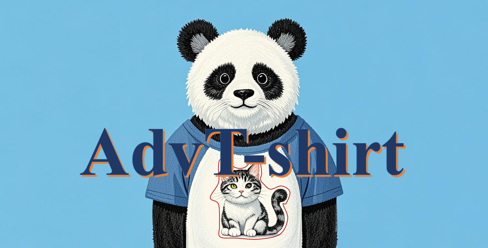
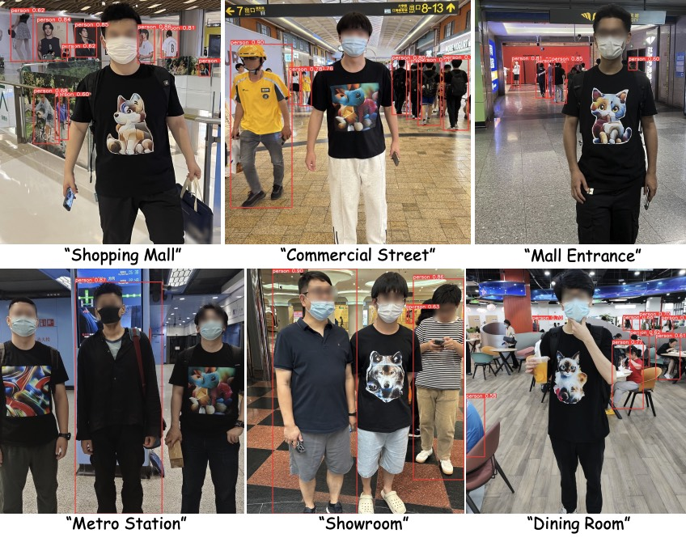
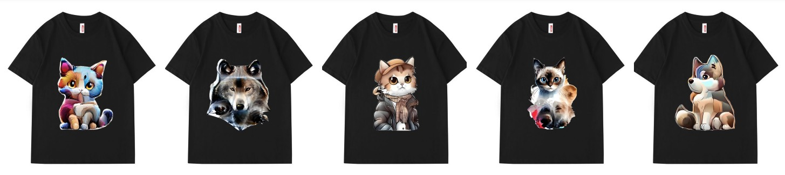
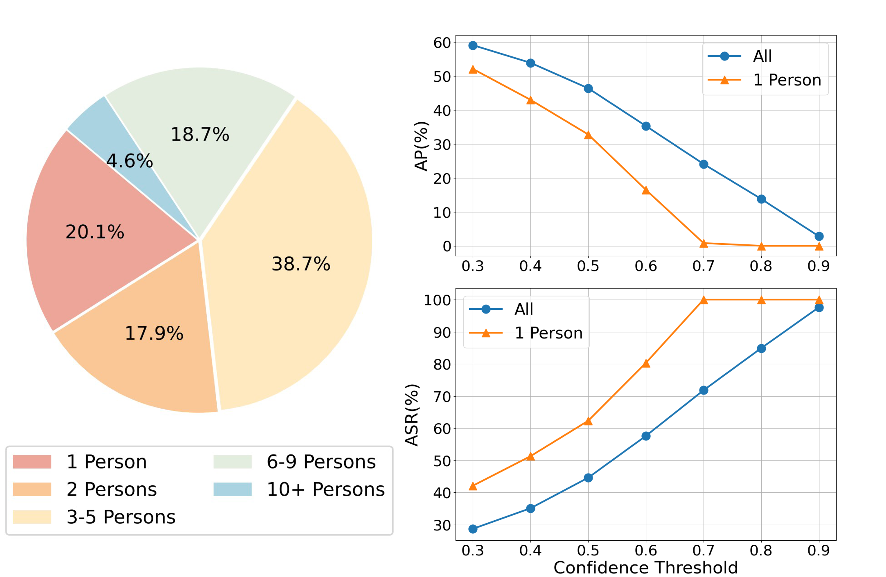

# AdvT-shirt-1K: A Physical-world Adversarial T-shirt Dataset for Adversarial Robustness Evaluation
<p align="center">
  
</p>

## 📌 Dataset Description

**AdvT-shirt-1K** is an adversarial patch dataset created for evaluating the robustness of YOLOv5s object detection models in physical-world environments. By attaching adversarial patches to the surface of T-shirts, this dataset simulates real-world evasion attack scenarios, providing researchers with an abundant collection of test samples and a benchmarking environment.

The physical patches are generated using our proposed method, **DiffPatch**, which is a diffusion-based adversarial patch generation method that allows customizable adversarial patches of various shapes and styles (based on reference images and masks), balancing attack performance and natural appearance.

Using **DiffPatch**, we designed **9 adversarial patches** and printed them on T-shirts. We recruited **20 participants** (with ethics approval) to capture images in diverse indoor and outdoor, including laboratories, campus, cafeteria, subway station, and shopping mall. In total, we collected **1,131 images** into **AdvT-shirt-1K** dataset, including both individual and group (2 to 10+ persons) photos. The dataset is accompanied with detailed annotations of the person and patch locations (bounding boxes). Our dataset provides a valuable resource for advancing defense research against adversarial patch attacks.

## 🎯 Key Features

* **Innovative Approach**: The dataset uniquely combines adversarial attacks with physical environments by applying adversarial patches to T-shirt surfaces, making it an effective tool for testing object detection models' resistance to evasion in real-world settings.
* **Diverse Scenarios**: It includes a variety of shooting conditions, lighting, backgrounds, angles, and movement states.
* **Real-world Context**: Designed to simulate dynamic wear and different environmental conditions, providing valuable insights into how adversarial attacks can affect detection accuracy.

## 📂 Dataset Contents

1. **Image Data**

* Contains images of subjects wearing adversarial T-shirts.
* Varied environments: indoor (laboratories, subway station), outdoor (sunlight, campus, shopping mall).
* Including both individual and group (2 to 10+ persons) photos, stored in different folders.

2. **Annotation Files**

* YOLO-style annotation format for object detection.
* Contains bounding box coordinates (including persons and adversarial patch). The person annotations correspond to the labels folder, and adversarial patch annotations correspond to the adv_labels folder.

3. **File Structure**

```
AdvT-shirt-1K
    |--1_person
        |--images
            |--0001.jpg
            |--0002.jpg
            ...
        |--labels
            |--0001.txt
            |--0002.txt
            ...
        |--adv_labels
            |--0001.txt
            |--0002.txt
            ...     
    |--2_persons
        ...
    ...
```


## 📊 Example Images
1. **Example images from AdvT-shirt-1K**

<p align="center">
  
</p>

2. **Adversarial T-shirts**

<p align="center">
  
</p>

3. **Test results on YOLOv5**

<p align="center">
  
</p>

* *Left*: The proportion of images with different numbers of persons in AdvT-shirt-1K.
* *Right*: The detection performance of YOLOv5s on AdvT-shirt-1K under different confidence thresholds.

## ⬇️ Download
[Download AdvT-shirt-1K dataset](https://huggingface.co/datasets/xingjunm/AdvT-shirt-1K)

## 📜 Cite Us
If you use this dataset in your research, please cite it as follows:

```
xxxxx
xxxxx
xxxxx
```

## 📧 Contact Us
For any questions or suggestions, feel free to contact us:

* Email: [click to email](mailto:zhixiangwang22@m.fudan.edu.cn)
* GitHub Issues: Submit questions or suggestions via the Issues tab

## 🌟 Welcome to star and fork the repo!
